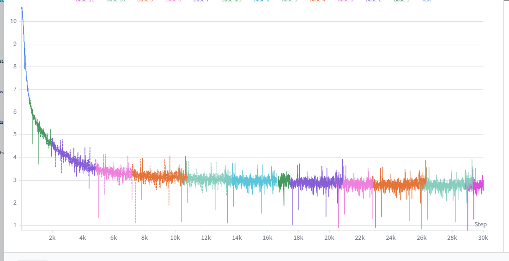

# Tiny-MoE


A lightweight Mixture-of-Experts language model implemented from scratch in native PyTorch.

Built and trained entirely on Kaggle using 2× NVIDIA T4 GPUs.

<p align="center">
    <br>
    <em>Pre-training loss over training steps</em>
</p>

## Table of Contents

- [Overview](#overview)
- [Quick Start](#quick-start)
- [Project Structure](#project-structure)
- [Features](#features)
- [Architecture](#architecture)
  - [Model Configuration](#model-configuration)
  - [Key Components](#key-components)
- [Training Pipeline](#training-pipeline)
- [Resources](#resources)
  - [Papers](#papers)
  - [Videos](#videos)
- [Notes](#notes)
- [License](#license)

---

## Overview

Tiny-MoE is an open-source, highly efficient Mixture-of-Experts (MoE) language model built entirely from scratch using native PyTorch.

Designed to maximize compute efficiency on Kaggle's free-tier cloud hardware (like dual NVIDIA T4 GPUs), this project serves as a clear, bottom-up implementation of modern LLM advancements including Multi-head Latent Attention (MLA), YaRN long-context extension, and optimized MoE routing architectures.

### Motivation & Goals

The primary motivation behind Tiny-MoE is to demystify the internal mechanics of state-of-the-art MoE models and tackle the complex engineering challenges of modern LLMs. Instead of relying on high-level frameworks or black-box library calls, every module—from the router to the specialized expert layers—is implemented completely from scratch. Built purely as a rigorous learning project, its goal is to bridge the gap between theoretical AI papers and real-world, hardware-constrained implementations.

### Model Specifications

- **Total Parameters:** ~150M–200M
- **Active Parameters:** ~70M–90M per token
- **Base Context Length:** 512 tokens
- **Extended Context Length:** 2048 tokens (via YaRN)
- **Hardware:** 2× NVIDIA T4 GPUs (Kaggle)
- **Architecture:** MoE Decoder-Only Transformer

---

## Quick Start

### Google Colab

[](https://colab.research.google.com/drive/1jL6f_axu_vZ3Pd_q92yUOd6DE5UQaiBn?usp=sharing)

### 1. Clone Repository

```bash
git clone https://github.com/AbdelrhmanEbied/Tiny-MoE.git
cd Tiny-MoE
```

### 2. Install

```bash
pip install -r requirements.txt
```

### 3. Train

```bash
!python -m training.trainer
```

### 4. Generate

```bash
!python -m inference.generate
```

---

## Project Structure

```text
Tiny-MoE/
├── assets/                          # Images and other assets used in the README.
├── inference/                       # Components for loading the model and generating text.
│   ├── __init__.py                  # Makes the inference directory a Python package.
│   ├── generate.py                  # Entry point for text generation.
│   ├── inference_configs.py         # Model loading and generation configurations.
│   ├── load_model.py                # Loads model checkpoints for inference.
│   ├── model_inference.py           # Model architecture optimized for inference.
│   └── sampler.py                   # Sampling strategies (Top-k, Top-p, temperature, etc.).
├── training/                        # Training pipeline, model architecture, data processing, and configuration.
│   ├── __init__.py                  # Makes the training directory a Python package.
│   ├── data.py                      # Dataset loading, preprocessing, and data pipelines.
│   ├── helpers.py                   # Shared helper functions used during training.
│   ├── model_train.py               # Model architecture and training entry point.
│   ├── trainer.py                   # Training pipeline, optimization, and checkpointing.
│   └── training_configs.py          # Model architecture and training configurations.
├── .gitignore                       # Specifies files and folders for Git to ignore.
├── README.md                        # Project documentation.
├── requirements-inference.txt       # Dependencies for inference and text generation.
└── requirements.txt                 # Dependencies for the entire project.
```

---

## Features

### Model Architecture

- Mixture-of-Experts (MoE) transformer implemented entirely from scratch
- Multi-head Latent Attention (MLA)
- Rotary Positional Embeddings (RoPE)
- YaRN long-context extension
- Shared expert architecture
- Weight absorption for optimized inference
- Native PyTorch implementation (no model framework dependencies)

### Training

- Streaming pre-training pipeline
- Packed sequence training for maximum GPU utilization
- Distributed training with DeepSpeed ZeRO Stage 2
- Mixed precision (FP16/BF16)
- Gradient checkpointing
- Torch Compile support
- Automatic checkpoint saving and resume
- Evaluation during training
- Learning rate warmup
- 8-bit AdamW optimizer support

### Inference

- Configurable generation pipeline
- Temperature sampling
- Top-k sampling
- Top-p (nucleus) sampling
- Repetition penalty
- N-gram blocking
- Automatic checkpoint loading

### MoE Optimizations

- Grouped GEMM expert execution
- Auxiliary router loss
- Router z-loss
- Expert load balancing
- Top-k routing

### Data Pipeline

- Hugging Face streaming datasets
- Multi-dataset interleaving
- Distributed dataset sharding
- Buffer-based shuffling
- Dynamic token packing
- Pre-training and instruction fine-tuning support

### Monitoring

- Training and validation loss
- Perplexity tracking
- Router entropy
- Router confidence
- Expert utilization
- Load ratio
- Load standard deviation
- Minimum/maximum expert load
- Weights & Biases integration

---

## Architecture

Tiny-MoE is a decoder-only Transformer language model built entirely from scratch in native PyTorch. It combines modern LLM techniques such as Multi-head Latent Attention (MLA), Rotary Position Embeddings (RoPE), Mixture-of-Experts (MoE), and a shared expert architecture while maintaining a lightweight parameter budget.

The model consists of 14 decoder layers. Each layer contains an MLA attention block followed by a Mixture-of-Experts feed-forward network with 8 routed experts, 1 shared expert, and Top-2 routing. During inference, weight absorption can be enabled to reduce computation and improve efficiency.

### Overall Architecture

```text
                           Tiny-MoE

                ┌────────────────────────────────────┐
                │        Streaming Datasets          │
                └────────────────────────────────────┘
                               │
                               ▼
                     Text Preprocessing
              • Tokenization
              • Sequence Packing
              • Token Buffer (512 tokens)
                               │
                               ▼
                     Training Sample
        ┌────────────────────────────────────────┐
        │ input_ids                             │
        │ position_ids                          │
        │ labels (shifted input_ids)            │
        └────────────────────────────────────────┘
                               │
                               ▼
                        Token Embeddings
                               │
                               ▼
                    14 × Transformer Blocks
                               │
                               ▼
                         Final RMSNorm
                               │
                               ▼
                            LM Head
                               │
                               ▼
                    Next Token Prediction
```

### Transformer Block

```text
                     Transformer Block

                         Input
                           │
                           ▼
                       RMSNorm
                           │
                           ▼
               Multi-head Latent Attention
                  ├── RoPE Positional Encoding
                  └── SDPA Attention
                           │
                           ▼
                     Residual Add
                           │
                           ▼
                       RMSNorm
                           │
                           ▼
                    MoE Router (Top-2)
                      ├───────────────┐
                      ▼               ▼
                 Routed Experts    Shared Expert
                  (8 Experts)       (1 Expert)
                      └───────┬───────┘
                              ▼
                      Grouped GEMM
                              │
                              ▼
                       Residual Add
                              │
                              ▼
                            Output
```

### Model Configuration

| Parameter | Value |
|-----------|------:|
| Vocabulary Size | 32,000 |
| Hidden Size | 512 |
| Transformer Layers | 14 |
| Attention Heads | 8 |
| Routed Experts | 8 |
| Shared Experts | 1 |
| Experts per Token | 2 |
| MoE Intermediate Size | 1024 |
| Maximum Context Length | 512 |
| RMSNorm Epsilon | 1e-6 |
| RoPE Theta | 10,000 |
| Attention Implementation | SDPA |
| Weight Tying | Enabled |

### Key Components

#### Multi-head Latent Attention (MLA)

- KV compression using latent representations
- SDPA attention backend
- Rotary positional embeddings (RoPE)
- Optional YaRN context extension
- Weight absorption for efficient inference

#### Mixture-of-Experts (MoE)

- 8 routed experts
- 1 shared expert
- Top-2 routing
- Capacity factor of 1.25
- Grouped GEMM expert execution
- Auxiliary router loss
- Router z-loss
- Expert load balancing metrics

#### Positional Encoding

- Rotary Position Embeddings (RoPE)
- Optional YaRN scaling for long-context fine-tuning

#### Normalization

- RMSNorm before attention
- RMSNorm before MoE

---

## Training Pipeline

### Data

Tiny-MoE is pretrained using a streaming data pipeline built on Hugging Face Datasets. Rather than downloading the full datasets to disk, samples are streamed on demand, reducing storage requirements and enabling training on very large corpora.

**Training Datasets**

| Dataset | Purpose | Sampling Probability |
|----------|---------|--------------------:|
| FineWeb-Edu (sample-10BT) | General web and educational text | 60% |
| Cosmopedia v2 | Synthetic educational corpus | 25% |
| Open-Web-Math | Mathematical reasoning | 15% |

The datasets are interleaved using fixed sampling probabilities with the `all_exhausted` stopping strategy to ensure balanced exposure throughout training.

### Streaming Pipeline

The streaming dataset pipeline performs the following operations:

1. Stream samples directly from Hugging Face.
2. Interleave multiple datasets with configurable probabilities.
3. Shuffle using a large buffer for approximate randomness.
4. Shard the stream across distributed processes and DataLoader workers.
5. Tokenize incoming text.
6. Append tokens into a continuous token buffer.
7. Pack contiguous windows of max sequence length (512) tokens.
8. Generate:
   - `input_ids`
   - `position_ids`
   - shifted `labels`

This approach minimizes wasted tokens while maintaining high GPU utilization.

### Sequence Packing

Instead of padding individual documents, Tiny-MoE concatenates tokenized text into a continuous token buffer before slicing fixed-length training sequences.

Benefits include:

- Higher GPU utilization
- Minimal padding overhead
- Improved training throughput
- Better utilization of streaming datasets

### Training Configuration

| Setting | Value |
|---------|------:|
| Optimizer | 8-bit AdamW |
| Learning Rate | 2.5e-4 |
| Weight Decay | 0.1 |
| Betas | (0.9, 0.95) |
| Gradient Clipping | 1.0 |
| Training Steps | 30,000 |
| Warmup Steps | 2,800 |
| Micro Batch Size | 64 |
| Gradient Accumulation | 4 |
| Effective Sequence Length | 512 |
| Precision | FP16 |

### Optimization

Training uses:

- 8-bit AdamW optimizer
- Linear learning-rate warmup
- Gradient clipping
- Mixed precision (FP16)
- Gradient accumulation
- Torch Compile
- Activation checkpointing

These techniques improve training throughput while reducing GPU memory consumption.

### DeepSpeed

Tiny-MoE integrates DeepSpeed for efficient distributed training.

Features include:

- ZeRO Stage 2 optimization
- Expert Parallelism
- Communication overlap
- Reduce-scatter
- AllGather optimization
- MoE parameter grouping
- Contiguous gradient optimization
- Activation checkpointing support

### MoE Training

To improve routing stability, the trainer applies:

- Auxiliary router loss
- Router z-loss
- Top-2 expert routing
- Capacity factor of 1.25
- Grouped GEMM execution
- Shared expert routing

During training the router reports:

- Expert utilization
- Router entropy
- Router confidence
- Load ratio
- Load standard deviation
- Minimum expert load
- Maximum expert load

### Monitoring

The trainer automatically logs:

- Training loss
- Validation loss
- Perplexity
- Learning rate
- Gradient norm
- Router metrics
- Training throughput

Training progress is logged using **Weights & Biases**.

### Checkpointing

The training pipeline automatically:

- Saves checkpoints periodically
- Saves optimizer state
- Saves scheduler state
- Supports automatic resume from the latest checkpoint

### Hardware

The project was developed and trained entirely on **Kaggle** using:

- 2 × NVIDIA T4 GPUs
- Native PyTorch
- DeepSpeed
- Hugging Face Datasets

### Training Notes

- Training performed entirely on free Kaggle hardware.
- Streaming datasets eliminate the need to download massive corpora.
- Dynamic sequence packing maximizes GPU utilization.
- Designed for efficient long-running distributed training.
- YaRN can be applied during continued training to extend the model's context length.

---

## Resources

### Papers

**Core Papers**

| Paper Title | Year | Primary Focus / Architecture | Link |
| :--- | :---: | :--- | :---: |
| **Attention Is All You Need** | 2017 | Vanilla Transformer Framework | [PDF](https://arxiv.org/pdf/1706.03762) |
| **Root Mean Square Layer Normalization** | 2019 | Efficient Activation Normalization (RMSNorm) | [PDF](https://arxiv.org/pdf/1910.07467) |
| **RoFormer: Enhanced Transformer with Rotary Position Embedding** | 2021 | Rotary Position Embeddings (RoPE) | [PDF](https://arxiv.org/pdf/2104.09864) |
| **DeepSeek-V2: A Strong, Economical, and Efficient Mixture-of-Experts Language Model** | 2024 | DeepSeekMoE Architecture & MLA | [PDF](https://arxiv.org/pdf/2405.04434) |
| **DeepSeek-V3 Technical Report** | 2024 | Advanced MoE Scaling & Auxiliary-Loss-Free Routing | [PDF](https://arxiv.org/pdf/2412.19437) |

**Additional Reading**

| Paper Title | Year | Primary Focus / Architecture | Link |
| :--- | :---: | :--- | :---: |
| **Mixture of Experts in Large Language Models** | 2025 | Comprehensive Literature Survey on MoE Systems | [PDF](https://arxiv.org/pdf/2507.11181) |

### Videos

- [How DeepSeek Rewrote the Transformer [MLA]](https://www.youtube.com/watch?v=0VLAoVGf_74)
- [How Attention Got So Efficient [GQA/MLA/DSA]](https://www.youtube.com/watch?v=Y-o545eYjXM)
- [Mixture of Experts (MoE), Visually Explained](https://www.youtube.com/watch?v=0QQlYR1r6pQ)
- [The Most Underrated Layer Inside Every AI Model](https://www.youtube.com/watch?v=JHl_gwVoh-k)
- [How Rotary Position Embedding Supercharges Modern LLMs [RoPE]](https://www.youtube.com/watch?v=GQPOtyITy54)
- [RoPE (Rotary Positional Embeddings) Explained: The Positional Workhorse of Modern LLMs](https://www.youtube.com/watch?v=SMBkImDWOyQ)
- [What is Temperature in LLM](https://www.youtube.com/watch?v=jnikMver_CE)

---

## Notes

### Current Limitations

> **Note**
>
> Tiny-MoE is primarily a research and learning project.
>
> While it has been instruction-tuned, its conversational abilities are currently limited and it may produce lower-quality responses than larger, production-ready language models.
>
> The primary focus of this project has been implementing and understanding modern LLM architectures and training techniques from scratch, rather than maximizing chat performance.
>
> Future updates will include additional instruction tuning, preference optimization, and continued training to improve the model's conversational quality and overall capabilities.

---

## License

This project is licensed under the **Apache License 2.0**.

You are free to use, modify, and distribute this software in accordance with the terms of the license. See the [LICENSE](LICENSE) file for the full license text.
